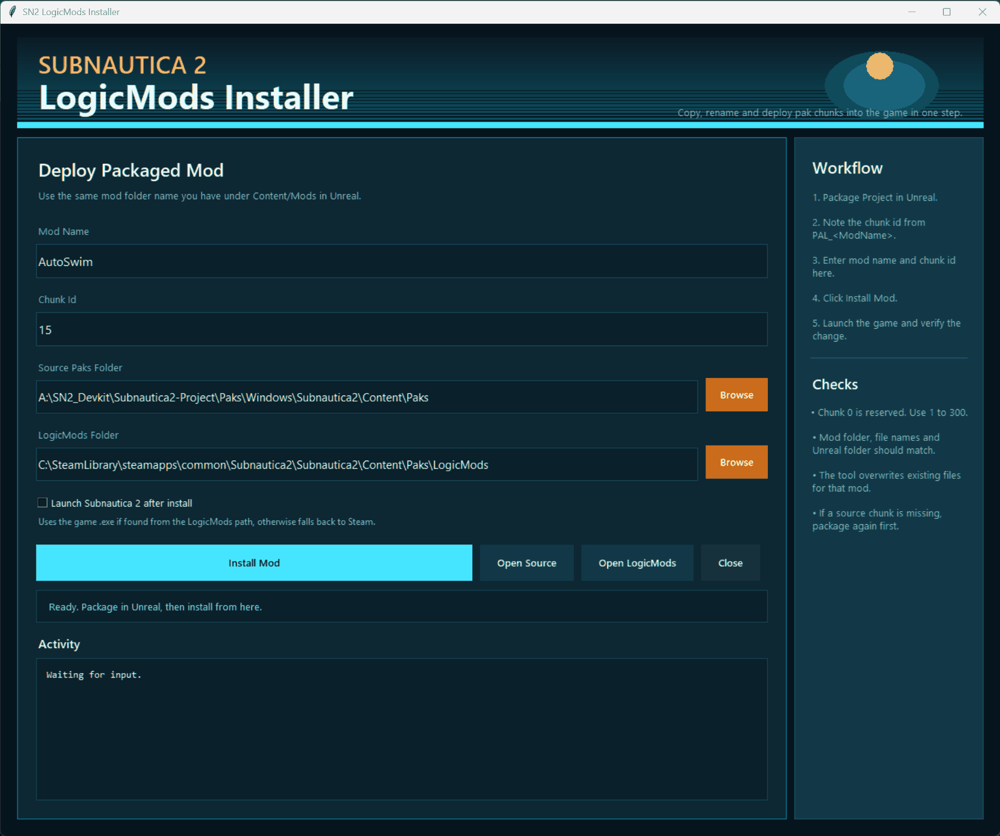

# SN2 Mod Installer

Desktop helper for installing packaged Subnautica 2 LogicMods without manually copying and renaming Unreal chunk files every time.



## Why it exists

Subnautica 2 mods packaged from Unreal output chunk files named like `pakchunk15-Windows.pak`, `pakchunk15-Windows.ucas`, and `pakchunk15-Windows.utoc`. For local testing, those files need to be copied into the game's `LogicMods` folder and renamed to the mod name.

This tool turns that repeated install step into a small UI: pick the packaged output folder, pick the game's `LogicMods` folder, enter the mod name/chunk id, and install.

## Features

- Copies `pak`, `ucas`, and `utoc` files in one action.
- Renames packaged chunk files to the selected mod name.
- Installs into `Subnautica2/Content/Paks/LogicMods/<ModName>`.
- Remembers local paths, mod name, chunk id, launch preference, and window placement.
- Reopens maximized or normal depending on the last saved state.
- Prevents duplicate app windows.
- Optionally launches Subnautica 2 after install.
- Auto-detects common Steam library locations and the adjacent Unreal packaged output folder.

## Local configuration

The app writes this ignored local file:

```text
app/Install-SN2-Mod.settings.json
```

It stores machine-specific paths and UI state, so it should not be committed.

If no local settings exist, the app tries to find:

- packaged Unreal output at `../Subnautica2-Project/Paks/Windows/Subnautica2/Content/Paks`;
- Subnautica 2 in common Steam library locations and `libraryfolders.vdf`.

If auto-detection misses your setup, use the Browse buttons once. The chosen paths are saved locally.

## Scope

This was built for my own Subnautica 2 modding workflow, but it should be useful for other local LogicMods testing setups as long as the packaged Unreal output uses the same `pakchunk<ID>-Windows.*` naming pattern and the game install path can be selected manually.

## Run

Double-click the root launcher:

```text
SN2 Mod Installer.vbs
```

The implementation lives under `app/` so the root folder stays clean.

Direct run:

```powershell
python .\app\Install-SN2-Mod.pyw
```
